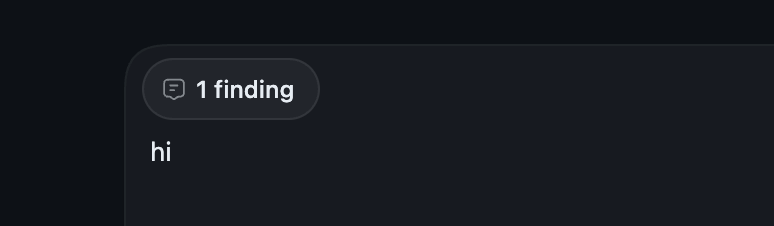

# codex-idea

Internal idea repo for Codex App UX concepts. This is intentionally a concept playground and can also be used as a structured notes app for testing product ideas.

The website is the primary artifact: it is where the static concept pictures and focused mocks are collected into one place.

## What this repo is (and is not)

- This repository is a **product-idea sandbox**, not a production-ready Codex feature.
- UI flows here are **mock concepts**
- There is **no real Codex execution integration**; outputs are simulated to communicate direction.
- It should be read as an **idea board**, not as a finalized spec.

## Ideas currently in this repo

1. **Plan Preview Image suggestion**
- Goal: reduce long build/rework loops by showing the intended implementation picture before execution.
- Website treatment:
  - static picture example using the exact README reference image
  - kept intentionally simple so it reads as an approval step, not as a toy demo


2. **Codex Multi-Run Split Screens**
- Goal: let users run multiple Codex tasks in parallel while seeing each prompt clearly.
- Website treatment:
  - one large split-screen reference instead of visible example panes
  - based on the shared multi-terminal screenshot so the prompts stay easy to read

3. **Chrome-Like Session Tabs**
- Goal: make multiple coding contexts easier to manage and switch between without losing state.
- Website treatment:
  - static picture section using the exact posted side-by-side browser reference
  - focus on keeping the Codex conversation docked next to the active page as a movable QoL view
- Suggested copy:
  - "Add Chrome-like tabs to Codex for moving around chat threads so multiple coding sessions can be organized and switched between more easily."


4. **Trusted Repo Auto-Open**
- Goal: skip repetitive repo selection when a trusted repository is already known and let Codex begin scanning immediately.
- Website treatment:
  - static picture section showing an iPhone-style toggle: `Switch on auto scanning when opening`
- Suggested copy:
  - "When opening Codex, if the repository is already trusted and selected, automatically load and start in that repo instead of waiting to prompt."

5. **Phone Emulator Should Be Easier**
- Goal: make quick mobile testing easier to reach from the main Codex workspace.
- Website treatment:
  - static picture section showing a quick-open mobile preview path
- Suggested copy:
  - some things already exist but would be cool to have it inside codex

6. **Session Sidebar With More and features**
- Goal: improve thread scanning by adding context beyond title-only rows.
- Website treatment:
  - Codex-like dark sidebar color modes
  - short description/subtitle under each thread title
  - adjustable thread-title font weight
  - one screenshot reference to show the sidebar treatment


7. **Pull Request Company Skills Radar**
- Goal: track pull-request workflow at the team level (not only individual level) and suggest process changes.
- Website treatment:
  - simplified explanation of where the underlying team skill should change
  - short sentences instead of a dense dashboard

8. **Plan Question UX**
- Goal: make plan questions easier to answer by exposing both intent and rationale inline.
- Website treatment:
  - one picture reference
  - one brief explanation of why the second `(i)` matters
  - one screenshot reference for the question helper pattern


8. **Make it possible to reference previous chats and compact it**
-Nice QoL if some previous chat was cooking and I don't wanna have to scroll up and copy things from it

10. **Codebase Memory Map (Moat but unsure)**
- Goal: let Codex reason from an internal repository map first, instead of repeatedly re-reading files.
- Website treatment:
  - simplified summary cards for symbols, dependencies, and ownership
  - keep `AGENTS.md` short while storing richer repo context elsewhere
- AGENTS.md guidance:
  - keep `AGENTS.md` focused and short (rules/workflows)
  - avoid turning `AGENTS.md` into a large knowledge dump

11. **Some elegant way to keep on prompting when codex is asking for a bunch of permissions**
- I occasionally get blocked by promptign due to codex asks for permissions. Sometimes I don't want to auto accept everything but my prompts can get lost or is just annoying

12. **Approval Flow QoL**
- Goal: reduce approval fatigue by making the decision path explicit and suggesting durable choices sooner.
- Website treatment:
  - one approval mock with three clear actions: `Allow once`, `Allow always for this repo/tool`, and `Ask again`
  - lightweight follow-up suggestion after repeated approvals: `You keep allowing this. Save it as a rule?`
  - keep the UI narrow and operational instead of turning it into a settings screen
- Suggested copy:
  - "When Codex asks for approval, make the options clearer: allow once, allow always in this repo for this tool/command family, or ask again next time."
  - "After a few repeated approvals, proactively suggest the narrower permanent rule instead of making the user keep clicking through the same prompt."

13. **Start In Worktree Immediately**
- Goal: let users create or enter a worktree before sending the first message.
- Website treatment:
  - quick action near new-thread/project controls: `Start in worktree`
  - branch picker before chat begins, so the worktree can be created right away
  - open into an empty thread already attached to that worktree instead of requiring a first prompt just to initialize it
- Suggested copy:
  - "Let users jump into a worktree immediately from the project UI, without spending the first prompt just to get the worktree created."

14. **Multiple Popout Windows**
- Goal: allow users to open more than one popout window at the same time instead of being limited to a single popup window.

15. **Playwright CLI Workflow QoL**
- Goal: add a more seamless way to do browser-driven tasks with Playwright CLI inside Codex, with less setup and fewer manual steps.
- Wrong target risk: too easy to operate on the wrong app, tab, file, page, or selection.
- Weak action verification: hard to prove that a click/paste/import actually landed correctly.

16. **Expandable Findings UI**
- Goal: make `x findings` clearer and actionable instead of leaving it as unclear static text in the chat.
- Website treatment:
  - hovering over or clicking the `x findings` chip should take you directly to the actual finding detail
  - it should feel like an interactive affordance, not dead text sitting in the chat
- Suggested copy:
  - "`x findings` is kinda unclear right now. I can't expand it and it just sits there in the chat."
  - "There is probably a more elegant solution here, like an inline expandable summary or a cleaner findings panel."
  - "Hovering over it or clicking it could take you straight to the finding instead of making you hunt for it."



17. **Popout MCP Approval Glitch**
- Goal: make MCP approval requests in popout windows behave reliably instead of occasionally duplicating and leaving one stuck behind.
- Suggested copy:
  - "In a popout window, when Codex asks for MCP stuff, it can occasionally glitch out and ask for the same thing twice."
  - "When I say yes, one of those requests can just stay there instead of resolving cleanly."
  - "The approval flow should dedupe identical MCP prompts and clear all matching pending requests once one approval succeeds."

## Why this format

- Capture hypotheses quickly.
- Compare UX options visually.
- Use the website as the main place where concept pictures are incorporated and reviewed.
- Keep notes on what looks promising vs what fails in practice.

## Tech stack

- React 18
- Vite
- TypeScript
- Vitest + Testing Library
- Playwright (single happy-path e2e script)

## Local preview

```bash
npm install
npm run dev
```

Then open the local URL printed by Vite in your browser.
Usually this is:

```text
http://localhost:5173/
```

## Tests

```bash
npm run test
npm run build
```

Optional e2e script:

```bash
npx playwright install chromium
npm run test:e2e
```

## CI and deployment

- CI workflow (`.github/workflows/ci.yml`) runs test + build on push/PR.
- Pages workflow (`.github/workflows/deploy-pages.yml`) builds and deploys `dist` on `main`.

## License

MIT
